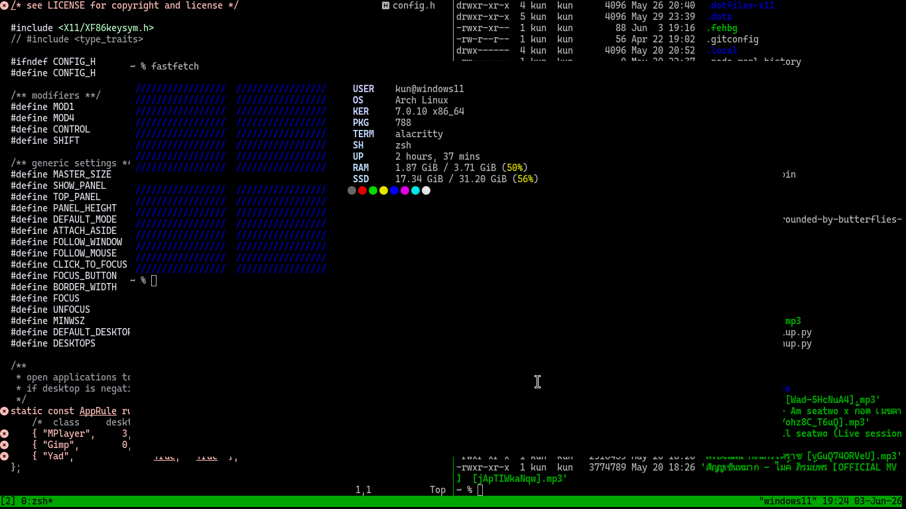
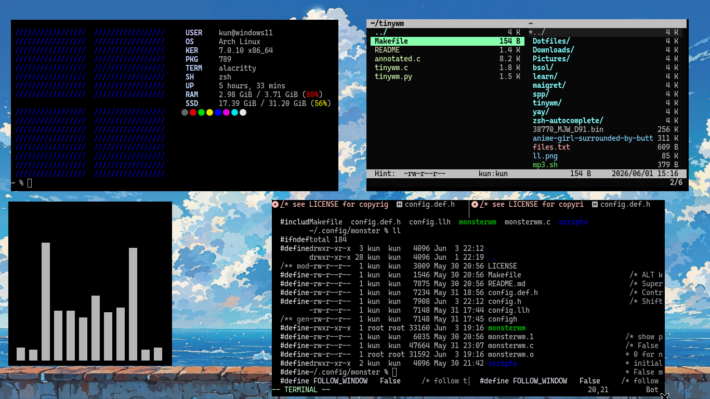
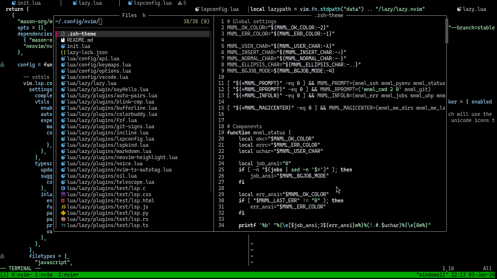
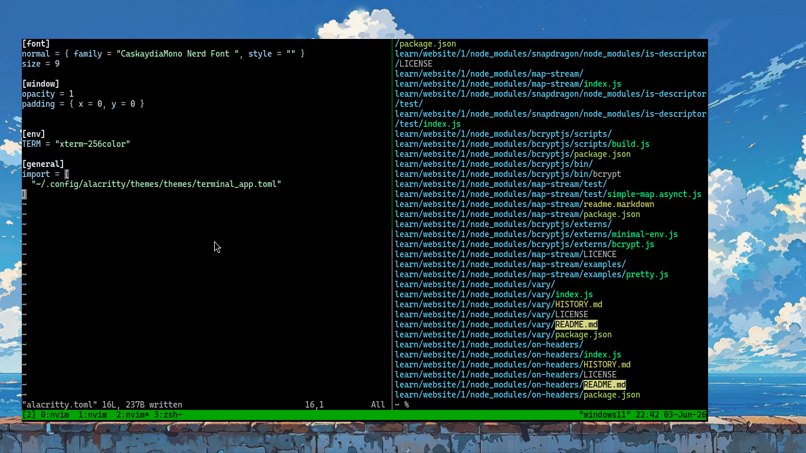

# Screenshot


# Monster


# Neovim


# Terminal Tmux



## System Information 

| Component         | Value                                                                 | 
| ----------------- | ------------------------------------------------------------------ |
| OS | [Arch Linux](https://archlinux.org/) |
| Display Server | [X11](https://www.x.org/wiki/?__goaway_challenge=meta-refresh&__goaway_id=823acb2db8759d4e469322238272bb0e&__goaway_referer=https%3A%2F%2Fwww.google.com%2F), [Wayland](https://wayland.freedesktop.org/) |
| WM | [Monsterwm](https://github.com/c00kiemon5ter/monsterwm), [Dwm](https://dwm.suckless.org/), [Dwl](https://github.com/djpohly/dwl) |
| Terminal | [Alacritty](https://alacritty.org/), [Kitty](https://sw.kovidgoyal.net/kitty/conf/) |
| Editor   | [Neovim](https://neovim.io/), [Vim](https://www.vim.org/),  |
| Shell    | [Zsh](https://github.com/ohmyzsh/ohmyzsh/wiki/Installing-ZSH) |
| Launcher | [Dmenu](https://tools.suckless.org/dmenu/), [Wmenu](https://codeberg.org/adnano/wmenu) |
| Launcher | [Thuanr](https://docs.xfce.org/xfce/thunar/start) |
| Font     | JetBrains Mono Nerd Font |
| Package Manager   | [pacman](https://wiki.archlinux.org/title/Pacman), [yay](https://wiki.archlinux.org/title/Arch_User_Repository) |

## Keybindings

| Key | Action |
|------|---------|
| Super + Enter | Open Terminal |
| Super + d | Launcher  |
| Super + e | Thunar  |
| Super + q | Close Window |
| Super + h/l | Focus Window |
| Super + Shift + q | Pkill Monster |
| Super + Shift + h/l | Resize Window Right/Left |
| Super + Shift + j/k | Resize Window Up/Down |
| Print | Screenshot Full |
| Shift + Print | sele Screenshot |
| Shift + 1-9   | DESKTOPCHANGEe |

## Features

- Minimal MonsterWM workflow
- Keyboard-driven navigation
- Fastfetch integration
- Neovim-centric development setup
- Alacritty terminal
- MPV media integration
- Lightweight and low resource usage

## Installation
```bash
git clone https://github.com/kun20101922/Dotfiles.git
cd Dotfiles

# Backup existing files
mv ~/.zshrc ~/.zshrc.bak 2>/dev/null
mv ~/.xinitrc ~/.xinitrc.bak 2>/dev/null

# Copy Configuration
cp -rv .config/* ~/.config
cp -rv .zshrc ~/.zshrc
cp -rv .xinitrc ~/.xinitrc
```

## Installation yay
```bash
git clone https://aur.archlinux.org/yay.git
cd yay
makepkg -si
```

## Dependencies

### Base Development
```bash
sudo pacman -S --needed \
    base-devel git gcc clang cmake
```

### Terminal & Tools
```bash
sudo pacman -S --needed \
   alacritty kitty tmux fzf fd vifm 
```

### Editors
```bash
sudo pacman -S --needed \
   neovim vim vi  
```

### X11
```bash
sudo pacman -S --needed \
    xorg-server xorg-xinit xorg-xranr xorg-setxkbmap
```

### Wayland
```bash
sudo pacman -S --needed \
    wayland wayland-protocols
```

### Wallpaper
```bash
sudo pacman -S --needed \
    feh
```

### Audio
```bash
sudo pacman -S --needed \
    pipewire pipewire-alsa pipewire-pulse pipewire-jack
```

### Files Manager
```bash
sudo pacman -S --needed \
    thuar 
```

### Media
```bash
sudo pacman -S --needed \
    mpv yt-dlp ytfzf 
```

### Media
```bash
sudo pacman -S --needed \
    mpv yt-dlp ytfzf 
```

### Fonts
```bash
yay -S \
    adobe-source-code-pro-fonts \
    noto-fonts-emoji \
    otf-font-awesome \
    ttf-droid \
    ttf-fira-code \
    ttf-jetbrains-mono \
    ttf-jetbrains-mono-nerd \
    ttf-victor-mono \
    brave-bin \
```


